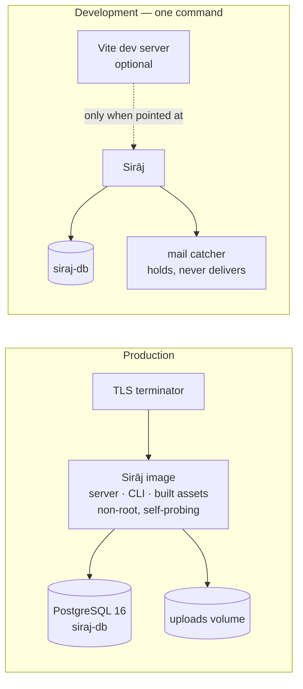

# Sirāj — Stack

Every piece this system runs on: what it is, what it does here, where it ends.
Versions, commands, variables, containers and gates live in this file and
nowhere else.

[ARCHITECTURE.md](ARCHITECTURE.md) is the shape and owns every domain rule.
[TODO.md](TODO.md) is the work and owns every code draft and migration body.
The split is [ARCHITECTURE.md](ARCHITECTURE.md), top of file (D15).

---

## 1. Today and target

| | Today | Target | Arrives |
|---|---|---|---|
| Render | Templ → Go, generated output committed | unchanged | — |
| Client | **12 components (374 lines) + one 2 690-line module file** | the last conversion, `roundSetup` | prompt 8b |
| Stylesheet | one file, 3 904 lines, **with spacing, type and width scales and four breakpoints** | the 153 inline styles that are left | prompt 9c |
| Assets | **Vite, per-file content hash, manifest-resolved** | same, carried into the image and the smoke walk | prompts 4–5 |
| External access | none | one versioned, credentialed JSON endpoint | prompts 7a–7b |
| Taxonomy | **two levels, admin-created** — the screens exist and an admin can add a subject area | the player's side: choosing one, and the grid grouped by it | prompts 6e–6f |
| First run | database only — **the app never starts** | one command, serving | prompt 1 |
| Production | same file as development, guarded | a deliberate overlay | prompt 1 |

**Three properties define the target.** Stateless compute, so any instance
serves any request. One artefact — a single image carrying server, CLI and
assets, fetching nothing at boot. And **degrades in layers, never cliffs**: no
script the page still works, no manifest the page still answers — unstyled, and
saying so in the log — no mail provider it logs. The one-command paths build
first (`./run.sh`, `make run`, `make build`), so nobody is left on the bottom
layer by accident.

**A fourth governs the tree:** source and output never share a directory. Today
`static/` is both, which is why an unbundled source file is a public URL. The
target layout is [ARCHITECTURE.md §6](ARCHITECTURE.md).

---

## 2. The pieces

### 2.1 Server — Go 1.26.0 and eight direct dependencies

| Piece | Version | What it is | What it does here | Where it ends |
|---|---|---|---|---|
| Go | 1.26.0 | The language and toolchain | Everything server-side; one static binary per command | No plugins, no cgo |
| `a-h/templ` | v0.3.1020 | A typed HTML template compiler — templates become Go functions | Every byte of markup; output is committed and CI-checked | Never fetches, never authorises, never holds state between requests |
| `go-chi/chi/v5` | v5.3.2 | A router and middleware chain over `net/http` | The request tree and the middleware order | No framework conventions; handlers stay plain `http.Handler` |
| `jackc/pgx/v5` | v5.11.0 | A PostgreSQL driver and connection pool | Every query and transaction, through the repository layer | No ORM, no query builder, no migration runner of its own |
| `google/uuid` | v1.6.0 | UUID generation and parsing | User, session and attachment identifiers | — |
| `joho/godotenv` | v1.5.1 | Reads a `.env` file into the environment | Development convenience only; production passes real variables | Never a source of defaults — §5 owns those |
| `golang.org/x/crypto` | v0.57.0 | Password hashing and constant-time comparison | Credentials and reset tokens | — |
| `golang.org/x/text` | v0.42.0 | Language tags and collation | Locale negotiation and sorting in three languages | — |
| `anthropics/anthropic-sdk-go` | v1.75.0 | Claude API client | The `claude` translation provider, behind the `translate` interface | Optional. `TRANSLATE_PROVIDER=none` compiles and runs without reaching it |
| PostgreSQL | 16 (`postgres:16-alpine`) | The only datastore | Tables, constraints, transactions, full-text and trigram search, retention sweeps | No cache, queue or search engine beside it (D8) |

**Migrations** are plain numbered `.sql` files embedded in the binary and
applied on boot by `internal/database`. Forward-only; there is no down-runner,
so a rollback is a hand-written statement after a dump.

### 2.2 Frontend and tooling

| Piece | Version | What it is | What it does here | Where it ends |
|---|---|---|---|---|
| `@alpinejs/csp` | ^3.17.4 | Alpine's policy-safe build: a declarative layer binding markup attributes to component state, with **no runtime evaluation** | The 20 local-state widgets — what is open, selected, revealed, busy (D4) | No navigation, no fetching, no authority. Registered by name; the default build would need `unsafe-eval` and is not used (D1) |
| Vite | ^8.3.3 | A bundler and dev server | Produces `static/dist/` with per-file content hashes and a manifest; copies `web/public/` verbatim | Does not serve production traffic; nothing at runtime needs Node |
| Node | 22 (`node:22-alpine`) | The build host | Runs Vite in CI and in the image's first stage | Absent from the runtime image |
| `@neon/config` | ^1.8.3 | Neon project configuration | Imported by `neon.ts` | **Becomes a dev dependency at prompt 2** — nothing the server serves reaches it |
| `@neon/env` | ^1.5.0 | Provides the `neon-env` command | Local environment plumbing | Same — dev dependency |
| Mailpit | latest | An SMTP server that accepts everything and delivers nothing, with an HTTP API | The development mailbox, and what the smoke suite reads a reset link out of | Development only. Never started in production, and it is not a mail provider |
| Docker / Compose | Compose 2.40.3 verified | Container runtime and topology | The database locally; the whole stack from a clean clone | Compose owns topology, **never a credential value** |

> **The policy-safe build is `@alpinejs/csp`** — confirmed at install, before
> component one, because the gate in §7 would have caught a wrong one only
> after twenty components had been written in the wrong dialect. The entry is
> `web/src/js/alpine.js`; no page links it until the first conversion, since a
> runtime nobody summons is weight against the budget and nothing else.

### 2.3 The client inventory — all 26 closures

The shared helpers are `web/src/js/helpers.js`, imported by both halves.

**Becomes an Alpine component**

Each owns one element's state and nothing else. Under the policy-safe build a
directive carries a *name*, never an expression, so anything a template needs to
ask is a named property or method — which is why a repeated child (a pane, a
star) is its own small component rather than a conditional in the parent's
markup.

| Component | What it owns | Component | What it owns |
|---|---|---|---|
| `matchFormat` | Whether the team panel shows | `ticketKind` + `ticketPane` | Which extra field a support form asks for |
| `sourcePick` + `sourcePane` | Which pane of the round setup is showing | `cannedReply` | Pasting a saved reply into what staff are writing |
| `passwordReveal` | A password shown while it is typed, hidden on submit | `colourField` | A swatch and a text box holding one value |
| `questionNote` | A remark on the question just answered | `questionRating` + `ratingStar` | Stars lit under the pointer, one chosen |
| `authoredQuestions` | Adding a row to a set being written | `roundSetup` | *Still a module — the richest one, and the last* |

**Stays a plain module**

Six were always going to: network, media and clock code is not local state.
Nine more joined them once somebody read how each one attaches — they listen on
`document` or `window` rather than owning an element, and wrapping them would
mean an `x-data` on every form and every table in 31 templates, with the
behaviour silently absent from anything rendered outside a scope.

| Module | Why it stays |
|---|---|
| `chat` | Polling, attachments, receipts, optimistic send |
| `round` | The play clock and answer submission — server-authoritative |
| `events` | The server-sent-event connection itself |
| `voiceNotes` | `MediaRecorder`, blobs, permissions |
| `theme` | Paired with the render-blocking boot script; moving it reintroduces the flash it prevents |
| `liveRefresh` | Cross-page refresh driven by server events |
| `busyButtons` | One delegated `submit` listener covers every form, including ones rendered after load |
| `confirmForms` | The same, for every destructive press on the page |
| `dropdowns` | A document-level click closes whichever menu is open, which is a page-level fact |
| `sheets` | Opens and closes panels anywhere on the page, by name |
| `bulkSelect` | Delegated across a whole table, including rows paged in |
| `photoPreview` | Document-level, and holds an object URL it must revoke |
| `whoIsHere` | Driven by server events rather than by an element's own state |
| `messagePanel` | Repaints a list from the network; the panel is the subject, not the state |
| `sourceGroup` | Delegated across every pool on the match form, and empties the ones it hides |
| `picker` | Its work is fetching and injecting rows — a search, which is network code |

Alpine is not what holds a media recorder or an event stream. The two layers
coexist on every page from the first commit to the last; the unit of revert is
one widget.

> **Sizes order the queue; they do not locate anything.** Line numbers drift
> from prompt 6 onward — find a closure by its name.

### 2.4 How the page finds an asset

Sources live in `web/src` and are never served. The build writes
`static/dist/`, the binary embeds it, and `internal/assets` resolves an entry —
`js/app.js` — to the hashed filename the bundler wrote. A missing manifest is
not an error: the page answers without that asset and the log says so.

`web/public/boot.js` is the exception: copied verbatim, never bundled, and
linked as a **classic** script. A built entry is a module, a module script is
deferred by definition, and the theme boot must run before first paint.

With a dev server configured (`VITE_DEV_SERVER`), the same three tags point at
its origin instead, the policy admits that origin **in development only**, and
the dev client module performs the replacement.

The client sources used to be read **by nine places**, four of which searched a
*single file* for a string. All nine now read the tree:

| Where | Asserts |
|---|---|
| `views/styles_test.go` ×2 | Reads the stylesheet |
| `views/styles_test.go` | Reads the script — a class passes if **the script mentions it** |
| `views/composer_test.go` | Four waveform constants are in the script |
| `views/live_test.go` | Every published event name appears in the script |
| `handlers/rules_test.go` | Two team-minimum constants are in the script |
| `handlers/guestparity_test.go` | Reads the stylesheet |
| `.github/workflows/ci.yml` | `node --check` over every file under `web/src` |
| `scripts/smoke.sh` ×2 | Both files answer 200; the page links versioned URLs — still the old paths until prompt 5 |

**Repointing the paths would not have worked.** `rules_test.go` greps for a
constant living in `sourceGroup`, which *moves to Alpine*; repointed at one file
it would pass while asserting nothing — silent, which is worse than red. So the
four string-searching tests call `clientSources`, which concatenates every
client source and **fails on a tree under 50 KB**, and that floor is itself
tested against an empty directory.

### 2.5 The dependency policy

One dependency per concern. Anything optional sits behind an interface with a
working `none` implementation — translation, mail and uploads all run with
nothing configured. A new direct dependency is a decision with the same weight
as a new table: it must earn the audit, the upgrade and the supply-chain cost.

---

## 3. Boundaries — what each piece may and may not do

**Templ** owns every byte of markup. It never fetches, never decides
authorisation, never holds state between requests.

**Alpine** owns local state only. Twenty components, each registered by name.
If removing Alpine breaks what a page *means* rather than how it *feels*, the
boundary has been crossed.

> **The content policy decides the dialect.** Scripts are `'self'` with no
> inline script anywhere. Alpine's default evaluation builds functions at
> runtime and would need that relaxed; it is not relaxed. So state is
> registered by name and directives carry names rather than expressions.

**The content policy itself** is a package-level constant today and becomes a
function of configuration at prompt 3, so the dev server's origin and socket can
be admitted **in development only**. The production string stays byte-identical
and no variable can relax it on a live deployment.

**Vite** produces files. It does not serve production traffic, is not required
to run the application, and nothing at runtime needs Node installed.

**The REST surface** is a projection of the same data under the same filters,
with its own credential and rate limit. One read-only endpoint (D2), mounted
above the session layer so no cookie is read. It never gains a mutation without
gaining a version and a written contract first; the contract is `docs/api.md`
and `api/openapi.yaml`.

**PostgreSQL** holds the rules. A constraint in the schema beats a check in Go,
because the schema is the one thing every writer passes through.

**Compose** owns topology, never a credential value.

### 3.1 The progressive-enhancement contract

1. Every page is complete and usable with no script.
2. Every mutation is a form the server can process alone.
3. A script may prevent a default; it may never invent a capability with no route behind it.
4. A control that needs script does not appear without script.
5. A failed request returns the page to the state the server last confirmed.

Not nostalgia — it is why the application survives a policy violation, a failed
asset deploy, and a browser the toolchain has never seen.

---

## 4. Build and run

**You need** Go 1.26, Docker, and — from prompt 2 — Node 22. The template
compiler installs itself with `make tools`, pinned to the `go.mod` version; the
database comes up in a container.

| Want | Command |
|---|---|
| Everything, from nothing | `./run.sh` — database, templates, server on :8080 (`PORT=` to move it) |
| Database only | `make db-up` · `make db-down` · `make db-reset` starts clean |
| A psql shell on the development database | `make db-shell` |
| Install the template compiler | `make tools` |
| Run from source, assets from disk | `make run` (builds the assets, sets `STATIC_DIR=./static`) |
| Build both binaries into `bin/` | `make build` · `make clean` removes them |
| Regenerate templates after a `.templ` edit | `make generate` |
| The suite (needs a real database) | `make test` · `make check` adds vet · `make vet` alone |
| End-to-end HTTP walk against a running server | `make smoke` |
| Format Go and templates | `make fmt` |
| List every target | `make help` |
| Frontend assets | `make assets` · `npm run build` · `npm run dev` for the watcher, with `VITE_DEV_SERVER=http://localhost:5173` |

**The database handle.** `siraj-db` on port 5434, user and password `siraj`
locally. One name across compose, the task runner, CI, the smoke script and the
example environment; a second spelling is a defect, not a variant. The suite
builds and drops its own database per process and never touches this one.

**Two steps are deliberately manual.** Load the question bank
(`sirajctl seed`) and promote the first administrator (`sirajctl promote
<user>`) — neither happens on a restart, and nothing in the application can
grant privilege from nothing. The CLI gains `apikey new|list|revoke` at prompt
7a, and already carries `stats`.

**Generated output is committed.** `*_templ.go` beside every `*.templ`, never
hand-edited; CI regenerates and fails on a difference.

---

## 5. Configuration — every variable

Read from the environment, `.env` loaded if present. Twenty-five variables are
read by `internal/config`; `STATIC_DIR` is read by `cmd/server`. Production is
stricter than development and never relaxable by a variable on a live
deployment.

| Variable | Default | Notes |
|---|---|---|
| `APP_ENV` | `development` | `production` turns on every strict guard below |
| `APP_ADDR` | `:8080` | |
| `BASE_URL` | derived locally | **Required in production, and must be https** — it goes into reset and invite mail |
| `DATABASE_URL` | — | **Required.** No default, no fallback |
| `SESSION_SECRET` | generated | **Required in production.** Under 32 chars is refused *everywhere*, so the mistake is caught on a laptop |
| `SESSION_LIFETIME` | 720 h | |
| `SECURE_COOKIES` | `false` | **Must be true in production** — a session cookie without it travels in clear over any plain hop |
| `DEFAULT_LOCALE` | `ar` | |
| `SEED_ON_START` | `false` | Stays false. Loading the bank is a command somebody runs |
| `TRUSTED_PROXY_HOPS` | `0` | Zero ignores forwarded headers entirely. A security control: the rate limiters key on the peer address |
| `UPLOAD_DIR` | `data/uploads` | Empty disables uploads — correct for a deployment with no writable volume |
| `MAX_UPLOAD_MB` | `8` | |
| `MAX_FILES_PER_MESSAGE` | `5` | Below 1 is refused: an attach button that can never produce a send |
| `SMTP_HOST` `_PORT` `_USERNAME` `_PASSWORD` `_FROM_EMAIL` `_FROM_NAME` `_STARTTLS` | — / 587 / — / — / — / Sirāj / true | Host empty ⇒ the mailer logs instead of sending |
| `TRANSLATE_PROVIDER` | `none` | `claude` requires `ANTHROPIC_API_KEY`; `libretranslate` requires `LIBRETRANSLATE_URL`. An unknown value is refused at boot |
| `ANTHROPIC_API_KEY` `ANTHROPIC_MODEL` | — / `claude-opus-5` | |
| `LIBRETRANSLATE_URL` `_API_KEY` | — | |
| `STATIC_DIR` | empty | Set, assets are served from that directory instead of the embedded tree. `make run` sets it |
| `VITE_DEV_SERVER` | empty | The dev asset origin. Admitted to the content policy **in development only** and ignored outright in production, which a test asserts |

**Development and test, outside the binaries:** `TEST_DATABASE_URL` (the suite's
server, defaulted by the `Makefile`), `DB_CONTAINER` and `PORT` (both read by
`run.sh`).

**The pattern worth copying:** anything that would produce a *silently broken*
deployment fails at boot with a message naming the variable and what to set it
to. Anything optional degrades to a working null implementation.

---

## 6. Containers, image and operations

**The base stack is the clean clone** — one command, no configuration, no
secret to supply: outside production the signing secret is generated at boot,
so nothing fabricated enters version control. Three services: the database, the
application, and a mail catcher (Mailpit, interface on **8026**) so the
password-reset flow can be walked end to end instead of being the one path
nobody verifies. The production overlay gives the catcher a profile nobody
enables, which is how a service declared in the base file stays unstarted in a
deployment.

**Production is an overlay, never a profile** (D3). A required-variable guard
anywhere in a compose file fails the whole file *before* profile filtering,
which breaks the default command for everyone. Proven against Compose 2.40.3.
The overlay turns on `APP_ENV=production`, demands `SESSION_SECRET` and
`BASE_URL`, sets secure cookies and one proxy hop, and unpublishes the
application port because the terminator owns it.

**The image is three stages, and the order is forced.** `node:22-alpine`
installs from the lockfile and builds → `golang:1.26-alpine` copies that output
in **before** compiling, because the asset tree is embedded at compile time →
`alpine:3.20` runs as a non-root fixed uid, carrying neither Node nor a Go
toolchain. An asset stage
*beside* the compile stage produces an image with an empty asset directory and a
page that links nothing. The build context excludes `node_modules/`,
`static/dist/` and the documents so a stale local build cannot shadow the stage
output.

**Release.** One image carrying server, CLI and assets. Migrations on boot. The
image is its own probe — `server -healthcheck` — so the health check needs
neither curl nor a shell. The base still has busybox; a distroless base would
remove it, and is a decision nobody has taken.

**Operations.** One health endpoint · structured logs, one line per request, no
credential or body · migrate automatically but seed and promote by hand ·
uploads on a volume that outlives the container · back up the database and the
volume together. Retention windows are a guarantee, not a setting —
[ARCHITECTURE.md §9.2](ARCHITECTURE.md).

**Where the deployment is described.** `deploy/compose.yaml`,
`deploy/compose.prod.yaml` and `deploy/Dockerfile`. The build context is the
repository root, named explicitly, because the tree is what gets built and this
directory only describes it. The project name is pinned to `siraj` in the base
file: Compose otherwise derives it from the directory the file sits in, so
filing the description somewhere else would rename the project, orphan its
volumes and clash with a stack already running.

---

## 7. Gates — what a build refuses

**CI today, in order:** templates current · formatting · build · vet · the full
suite against a real PostgreSQL · client script syntax.

**Landed since:** the production content policy grants no evaluation exception
even with a dev origin configured — a test, not a reading (prompt 3); the asset
build, which fails the job if it produces no manifest; and a clean-clone job
that runs one command, waits for the probe, and then **requests every asset the
landing page links** — a page that answers while linking files nobody built is
the failure that otherwise reads as success (prompt 4).

**Fitness functions.** Architecture only written down drifts. These are the
rules as tests, so a violation fails a build rather than a review:

layers point one way · the production policy grants no evaluation exception ·
server and client agree on shared constants · nothing unreviewed is reachable ·
nothing retired is drawn or counted, at either level of the taxonomy · every
screen answers · every screen is labelled · no layout overflows · catalogues
complete both directions · a clean clone comes up · generated output current.

**The list is the architecture.** Anything in these three files that cannot
eventually become one of these is a preference and should be marked as one.

---

## 8. Posture and limits

**Twelve-factor:** ten green. Two warnings, both honest — concurrency is capped
by the local upload volume, and logs have no trace correlation yet.

**Observability target:** three signals on one correlation id. Logs already
structured; metrics for every number in the performance budget, or it is not a
budget; traces for request, database, mail and translation spans. **Four
alerts, not forty** — error rate, p99 latency, pool exhausted, probe failing.
No request body, credential, message content or attachment name in any signal.

**Scaling, in the order constraints actually bind:** add instances (stateless
already) → **move attachments to object storage — the one real blocker** → read
replica → fan events through the database or a broker → materialise
availability. No cache, no queue, no search engine, no mesh: the performance
budget ([ARCHITECTURE.md §9.4](ARCHITECTURE.md)) says when one is earned.

**Supply chain:** base images pinned by digest, lockfile-exact installs,
non-root fixed uid, no toolchain in the runtime stage, an SBOM kept with the
release, a vulnerability scan failing the build above a declared severity, and
no secret ever baked in.

**Resilience:** graceful shutdown with a drain window sized for the event
stream, not a typical request · idempotency keyed by a request key the form
carries · expand-then-contract for schema change, so ordinary change takes no
window · nothing destructive is one press.

---

## 9. What this stack refuses

**A single-page application** — it would cost the no-script guarantee, the
accessibility baseline real markup gives, and first paint on a slow phone, to
buy transitions.

**A component framework for twenty widgets** — twenty pieces of local state do
not justify a runtime, a build graph and an ecosystem.

**A second datastore before the first is the bottleneck** — every backing
service is a new failure mode, backup and upgrade path.

**Microservices** — six domains in one deployable with a compiler enforcing the
boundaries beats six deployables with a network between them, until team or
load makes independent deployment worth its cost.

**A CDN as a requirement** — assets may sit behind one as an optimisation; the
application must work without.

**A hardcoded structure** — a subject area, a category, a locale or a limit that
lives in Go instead of a row or a variable. Extending the product would mean a
deploy, and the admin screens would be decoration.

**Any fabricated value, for any reason** — sample content, a default secret, a
demo account, a placeholder translation. It is the first principle because
every one of those has shipped to production in some project somebody was sure
about.
